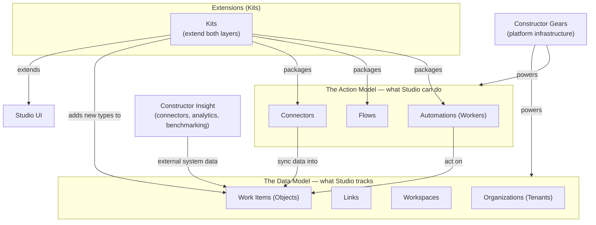

# Constructor Studio — Architecture and Domain Model Overview

This document explains how Constructor Studio is structured, what it tracks, and what it can do — in business terms. It is written for product managers, business owners, and engineering leaders who want to understand the shape of the system without reading engineering specifications. Technical terms appear in parentheses on their first use only.

<!-- toc -->

- [Visual Overview Map](#visual-overview-map)
- [Quick Reference](#quick-reference)
- [How PMs Use Studio](#how-pms-use-studio)
- [The Data Model](#the-data-model)
  - [Work Items](#work-items)
  - [Links](#links)
  - [Workspaces](#workspaces)
  - [Organizations](#organizations)
- [The Action Model](#the-action-model)
  - [Automations](#automations)
  - [Flows](#flows)
  - [Kits](#kits)
  - [Connectors](#connectors)
  - [Recommendations](#recommendations)
- [Governance and Quality Gates](#governance-and-quality-gates)
  - [Quality gates (Validators)](#quality-gates-validators)
  - [Human approval points](#human-approval-points)
  - [Policies](#policies)
  - [Model routing and cost control](#model-routing-and-cost-control)
  - [Audit trail](#audit-trail)
- [Glossary](#glossary)

<!-- /toc -->

---

> **How Studio connects to your tools:**
> Studio does not replace your existing tools — it connects to them. Adoption starts read-only: Studio maps your current SDLC graph and surfaces Recommendations without touching anything. Write-back actions are introduced gradually, on approval, after trust is established. The first step is connecting your existing tools via Connectors — Studio begins mapping your Work Item graph immediately, with no migration required.

## Visual Overview Map

The diagram below shows how Studio is structured: two layers — what Studio tracks and what it can do — extended by Kits, which can add capabilities to both.

---

## Quick Reference

| Business term | Technical term | One-sentence definition |
| --- | --- | --- |
| Organization | Tenant | Your company or business unit in Studio; controls which Kits are installed, which models are allowed, and which Workspaces exist. |
| Workspace | Workspace | The scope of a single project or product; every Work Item belongs to exactly one Workspace. |
| Work Item | Object | Anything Studio tracks: requirements, tasks, pull requests, incidents, designs, builds, and more. |
| Link | Link | A typed relationship between two Work Items (e.g. "implements", "derived from", "validates") that Studio uses for traceability and gap detection. |
| Automation | Worker | A reusable, typed action blueprint — like a template that Studio can execute. |
| Automation Run | WorkerRun | A timestamped record of one specific Automation execution, with its inputs, outputs, and status. |
| Flow | Flow | An ordered sequence of Automations with mandatory steps that Studio enforces; the sequence cannot be skipped. |
| Kit | Kit | A package of Automations, Flows, Connectors, new Work Item types, UI extensions, and rules that extends Studio for a specific domain or platform (e.g. SaaS SDLC, Jira integration). |
| Connector | Connector | An integration with an external tool (Jira, GitHub, GitLab, etc.) that syncs data into Studio and can write approved actions back. |
| Recommendation | Recommendation | A gap or risk detected by an Analyzer Automation, surfaced for PM review with a suggested action. |

---

## How PMs Use Studio

Each day, a PM using Studio gets a prioritized view of gaps, stale artifacts, and Recommendations — without switching between tools.

- **Review Recommendations** surfaced overnight — gaps, stale artifacts, coverage issues
- **Accept a Recommendation** → approve the suggested Automation before it runs
- **Create or link Work Items** — requirements, tasks, decisions — to build traceability
- **Monitor Flow run status** — see which mandatory steps passed, failed, or need approval
- **Check AI spend and staleness indicators** on the Workspace dashboard
- **Collaborate with engineering** — PM approves the Automation output before it is committed; engineering implements based on the approved output

---

## The Data Model

The Data Model is everything Studio knows — the living graph of your product's history, state, and relationships across the full Plan → Build → Operate lifecycle (Software Construction Lifecycle).

### Work Items

A Work Item (Object) is anything Studio tracks. Studio covers a broad range of categories:

| Category | Examples |
| --- | --- |
| Product and requirements | Requirements, PRDs, epics, user stories, acceptance criteria |
| Architecture and design | Designs, architecture decision records, components, API specs |
| Work tracking | Tasks, bugs, change requests, spikes |
| Source code | Repositories, branches, commits, pull requests |
| Build and delivery | Pipelines, builds, build artifacts, deployments |
| Operations | Alerts, incidents, runbooks, postmortems, SLOs |
| Security and compliance | Vulnerabilities, security findings, compliance checks |
| Release | Releases, release notes, release candidates |
| People and teams | Persons, teams, organization units |

Studio also tracks two important properties on every Work Item automatically:

- **Staleness.** Studio scores how out-of-date a Work Item is — based on time, changes to linked items, or sync gaps with external tools. A stale requirement or an unchanged design after a code change both raise the staleness score. When the score crosses a threshold, Studio surfaces a Recommendation.
- **Provenance.** Studio records who or what created or last changed each Work Item — whether that was a person or an Automation Run. This makes the full history of every artifact traceable.

### Links

Work Items connect to each other through Links. A Link is a typed relationship: one Work Item "implements" another, "derives from" it, "validates" it, or "supersedes" it. These typed connections are what allow Studio to answer questions like "which requirements have no test coverage?" or "which designs have no matching tasks?" Studio treats the Link graph as the primary source for gap detection, coverage analysis, and traceability reporting.

Links can be created manually in the Studio UI — connecting a requirement to a task, for example — or generated automatically by Automations and Connectors as they process Work Items.

Gap detection works on links that have been established — a requirement with no links is not visible to traceability analysis.

Automations and Connectors create many Links automatically as they run — manual linking fills in the rest. The more completely Work Items are linked, the more gaps Studio can detect.

### Workspaces

A Workspace is the scope boundary for a single project or product. Every Work Item belongs to exactly one Workspace. Workspaces can span multiple code repositories and hold all the artifacts, history, and Automation results for that product.

Within a Workspace, Projects group related Work Items — a product Workspace might contain separate Projects for different features, teams, or releases.

### Organizations

An Organization is your company or business unit in Studio. Organizations control which Kits are installed, which Automations are approved for use, which AI models may be used, and what spending limits apply. Organizations can be nested — a parent organization can contain child organizations, each with its own settings.

> **Where in Studio:** The Data Model is visible in the Workspace graph view and the Work Item detail panels. Staleness signals appear as indicators on Work Item cards. Provenance (who created or changed an item) is shown in the Work Item history panel.

---

## The Action Model

### Automations

An Automation (Worker) is a reusable, typed action blueprint. Think of an Automation the way you think of a template: the Automation is the template, and an Automation Run (WorkerRun) is one filled-in instance of that template being executed. Every time Studio runs an Automation, it creates a new Automation Run — a timestamped record that captures the inputs, outputs, and completion status of that specific execution.

Automations range from simple scripts to AI-assisted transformations. Examples include: generating a design document from a product requirement, decomposing a design into tasks, validating that a pull request matches its design, or scanning for security vulnerabilities.

Kits ship with pre-built Automations — the typical PM path is installing a Kit from the marketplace. Building custom Automations requires technical configuration by an engineering team.

### Flows

A Flow is an ordered sequence of Automations with mandatory steps. When a Flow runs, Studio enforces the sequence — mandatory steps cannot be skipped. A Flow can encode a complete engineering process — for example, a bug-fix Flow might require: validate the bug description, confirm the test fails, implement the fix, confirm the test passes. This is what a custom or Kit-provided Flow looks like in practice. Flows make process compliance automatic **once configured** — mandatory steps cannot be skipped.

### Kits

A Kit is a delivery knowledge package. It bundles Automations, Flows, Connectors, new Work Item types, UI extensions, and rules together for a specific domain or platform. New Work Item types extend Studio's data model — for example, a Jira Kit can introduce a "Jira Issue" type that enriches the standard Task with Jira-specific fields. UI extensions add domain-specific views, panels, and actions to the Studio interface without touching its core. Kits can be open-source or proprietary — a team or vendor can publish a Kit that encodes their best practices. Organization administrators approve which Kits are available to the team — a one-time setup step. Once approved, team members work with the Kit's features directly. The SaaS SDLC Kit, for example, packages a complete set of Automations and Flows for multi-tenant SaaS development. Kits declare the permissions and governance settings they require — Organization administrators approve these at installation. Kits are the only extension unit: everything Studio is customized with goes through a Kit.

### Connectors

A Connector is an integration with an external tool. Connectors sync data from systems like Jira, GitHub, and GitLab into the Studio Work Item graph — keeping Studio's picture of your product current without requiring manual entry. Connectors can also write approved actions back to external systems: for example, when Studio creates a task or updates a ticket state, it can push that change through the Connector to Jira automatically, subject to the Organization's write-back policy. *(in development)*

Work Items created directly in Studio and Work Items synced from external tools (Jira, Confluence, GitHub Issues, etc.) are treated identically for traceability and analysis purposes — both live in the same Work Item graph. Externally synced items may have some fields managed by the Connector.

### Recommendations

Analyzer Automations run continuously — on a schedule or triggered by changes — and scan the Work Item graph for gaps and risks. When an Analyzer finds a problem, it creates a Recommendation: a named gap with a severity level, a reason, and a suggested Automation to fix it.

Examples of what Recommendations surface: a requirement with no test coverage, a design document that has not been updated after a related requirement changed, a stale task that no longer maps to any active requirement, or an AI spending rate approaching the monthly budget cap. Product managers review Recommendations on the Workspace dashboard and decide which to act on — accepting a Recommendation launches the suggested Automation, which requires a PM approval before it executes.

Studio also supports agentic loops *(in development)* — Automations that iterate until a quality threshold is met — a capability covered separately when available.

> **Where in Studio:** Automations are browsable in the Automations catalog. Flows appear in the Flow library. Recommendations surface on the Workspace dashboard and in Work Item detail panels. Automation Run history is accessible per Work Item.

---

## Governance and Quality Gates

Studio's governance model keeps Studio acting within your organization's risk boundaries — through five controls: quality gates, human approvals, policies, cost control, and audit.

### Quality gates (Validators)

Every Automation that produces an artifact can be followed by a quality gate (Validator). A quality gate checks the output — pass, fail, or retry. If an output fails its gate, Studio retries the Automation up to a configured limit. If the limit is reached without a passing result, the gate escalates to a human reviewer for a decision. This creates bounded automation: Studio never loops without limit, and every escalation is a traceable event.

### Human approval points

High-risk actions — such as releasing to production, accepting a security exception, or upgrading a Kit with breaking changes — require explicit human approval before they proceed. Approvals can be chained (two approvers must agree before an action runs) and delegated (an approver can hand off to a designated colleague). Nothing happens until the right person approves.

Approval requirements are defined in Flows and Kits — Kit and Flow designers declare which actions require approval. Administrators configure who the designated approvers are at the Organization level or narrowed per Workspace.

### Policies

Organizations set policies that govern what Automations may do: which categories of Automation are permitted, which AI models are allowed, and what monthly spending cap applies. Policies apply at the Organization level and can be narrowed — but never expanded — for individual Workspaces. This ensures that company-wide rules are always enforced regardless of local settings.

Workspace administrators *(typically the PM or team lead who owns the Workspace)* can apply stricter settings within the bounds their Organization has set.

Kits declare the permissions and governance settings they require — Organization administrators approve these at installation.

### Model routing and cost control

Studio routes each Automation to the most cost-effective AI model capable of the task — small models for classification and extraction, large models only for complex reasoning. Organization administrators can lock this routing so team members cannot override it. Organization administrators set monthly budget caps — when a cap is approaching, Studio surfaces a Recommendation; when the cap is reached, new AI Automation Runs are blocked until the budget is reviewed.

### Audit trail

Every Automation Run is an immutable record in the audit trail, capturing its inputs, outputs, status, cost, and trigger. The audit trail can be queried per Work Item, per Automation, or per time range.

> **Where in Studio:** Validation results and Approvals appear in the Governance view. Audit history is accessible per Work Item and per Automation Run. Cost reports and budget status are visible in the Organization settings panel.

---

> **About Constructor Fabric:** Constructor Studio is one element of Constructor Fabric, which also includes Constructor Insight (connectors, analytics, and benchmarking) and Constructor Gears (the underlying platform infrastructure that Studio builds on). Studio's core graph, validators, and connectors are open-source; proprietary Kits and enterprise features extend the open-source foundation.

---

> **Next steps:** Review the Recommendations on your Workspace dashboard → accept one and approve its suggested Automation → check staleness indicators on your key requirements → work with your Organization administrator to connect additional tools and expand your Kits as coverage grows.

## Glossary

Terms in the Quick Reference table above are not repeated here. This glossary covers additional terms used in the document.

| Business term | Technical term | Definition |
| --- | --- | --- |
| Work Item graph | Object graph | The full graph of Work Items and their Links across a Workspace. |
| Quality gate | Validator | A check run after an Automation output — pass, fail, retry, or escalate to a human reviewer. |
| Staleness score | stalenessScore | A score (0–1) indicating how out-of-date a Work Item is, based on time, linked item changes, and sync gaps. |
| Provenance | createdByRunId / lastModifiedByRunId | The record of which person or Automation Run created or last changed a Work Item. |
| Approval | Approval | An explicit human sign-off required before a high-risk action can proceed. |
| Policy | Policy | Organization-level rules governing which Automations are permitted, which models are allowed, and spending caps. |
| Audit trail | AuditLog / WorkerRun records | The immutable log of every Automation Run — inputs, outputs, cost, trigger, and status. |
| Model routing | ModelRouter | The system that selects the most cost-effective AI model for each Automation task. |
| Constructor Fabric | — | The umbrella product family: Studio + Insight + Gears together. |
| Constructor Gears | — | The underlying platform infrastructure (identity, events, model gateway) that Studio builds on. |
| Constructor Insight | — | The connectors, analytics, and benchmarking layer that feeds data into Studio. |
