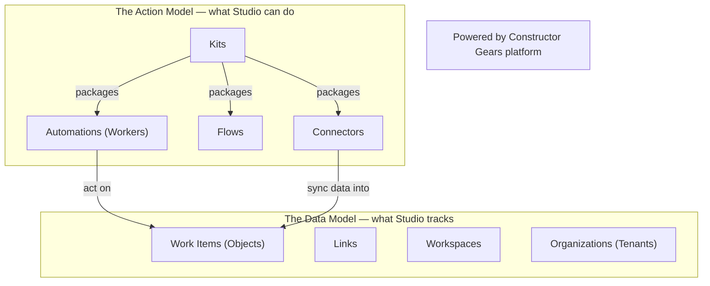

# Constructor Studio — Architecture and Domain Model Overview

This document explains how Constructor Studio is structured, what it tracks, and what it can do — in business terms. It is written for product managers and business owners who want to understand the shape of the system without reading engineering specifications. Technical terms appear in parentheses on their first use only.

---

## Visual Overview Map

The diagram below shows the two layers that make up Studio. The top layer — the Action Model — defines everything Studio can do. The bottom layer — the Data Model — defines everything Studio tracks. Automations in the top layer read and update Work Items in the bottom layer.

---

## Quick Reference

| Business term | Technical term | One-sentence definition |
|---|---|---|
| Organization | Tenant | Your company or business unit in Studio; controls which Kits are installed, which models are allowed, and which Workspaces exist. |
| Workspace | Workspace | The scope of a single project or product; every Work Item belongs to exactly one Workspace. |
| Work Item | Object | Anything Studio tracks: requirements, tasks, pull requests, incidents, designs, builds, and more. |
| Link | Link | A typed relationship between two Work Items (e.g. "implements", "derived from", "validates") that Studio uses for traceability and gap detection. |
| Automation | Worker | A reusable, typed action blueprint — like a template that Studio can execute. |
| Automation Run | WorkerRun | A timestamped record of one specific Automation execution, with its inputs, outputs, and status. |
| Flow | Flow | An ordered sequence of Automations with mandatory steps that Studio enforces; the sequence cannot be skipped. |
| Kit | Kit | A package of Automations, Flows, Connectors, and rules that extends Studio for a specific domain or platform (e.g. SaaS SDLC, Jira integration). |
| Connector | Connector | An integration with an external tool (Jira, GitHub, GitLab, etc.) that syncs data into Studio and can write approved actions back. |
| Recommendation | Recommendation | A gap or risk detected by an Analyzer Automation, surfaced for PM review with a suggested action. |

---

## The Data Model

The Data Model is everything Studio knows — the living graph of your product's history, state, and relationships across the full Plan-to-Operate lifecycle.

### Work Items

A Work Item (Object) is anything Studio tracks. Studio covers a broad range of categories:

| Category | Examples |
|---|---|
| Product and requirements | Requirements, PRDs, epics, user stories, acceptance criteria |
| Architecture and design | Designs, architecture decision records, components, API specs |
| Work tracking | Tasks, bugs, change requests, spikes |
| Source code | Repositories, branches, commits, pull requests |
| Build and delivery | Pipelines, builds, build artifacts, deployments |
| Operations | Alerts, incidents, runbooks, postmortems, SLOs |
| Security and compliance | Vulnerabilities, security findings, compliance checks |
| Release | Releases, release notes, release candidates |
| People and teams | Persons, teams, organization units |

Studio also tracks two important properties on every Work Item automatically:

- **Staleness.** Studio scores how out-of-date a Work Item is — based on time, changes to linked items, or sync gaps with external tools. A stale requirement or an unchanged design after a code change both raise the staleness score. When the score crosses a threshold, Studio surfaces a Recommendation.
- **Provenance.** Studio records who or what created or last changed each Work Item — whether that was a person or an Automation Run. This makes the full history of every artifact traceable.

### Links

Work Items connect to each other through Links. A Link is a typed relationship: one Work Item "implements" another, "derives from" it, "validates" it, or "supersedes" it. These typed connections are what allow Studio to answer questions like "which requirements have no test coverage?" or "which designs have no matching tasks?" Studio treats the Link graph as the primary source for gap detection, coverage analysis, and traceability reporting.

### Workspaces

A Workspace is the scope boundary for a single project or product. Every Work Item belongs to exactly one Workspace. Workspaces can span multiple code repositories and hold all the artifacts, history, and Automation results for that product.

### Organizations

An Organization is your company or business unit in Studio. Organizations control which Kits are installed, which Automations are approved for use, which AI models may be used, and what spending limits apply. Organizations can be nested — a parent organization can contain child organizations, each with its own settings.

> **Where in Studio:** The Data Model is visible in the Workspace graph view and the Work Item detail panels. Staleness signals appear as indicators on Work Item cards. Provenance (who created or changed an item) is shown in the Work Item history panel.

---

## The Action Model

The Action Model is everything Studio can do — the catalog of reusable capabilities that read, analyze, transform, and update Work Items.

### Automations

An Automation (Worker) is a reusable, typed action blueprint. Think of an Automation the way you think of a template: the Automation is the template, and an Automation Run (WorkerRun) is one filled-in instance of that template being executed. Every time Studio runs an Automation, it creates a new Automation Run — a timestamped record that captures the inputs, outputs, and completion status of that specific execution.

Automations range from simple scripts to AI-assisted transformations. Examples include: generating a design document from a product requirement, decomposing a design into tasks, validating that a pull request matches its design, or scanning for security vulnerabilities.

### Flows

A Flow is an ordered sequence of Automations with mandatory steps. When a Flow runs, Studio enforces the sequence — mandatory steps cannot be skipped. A Flow can encode a complete engineering process: for example, "to fix a bug, always validate the bug description first, then confirm the test fails, then confirm the test passes after the fix." Flows make process compliance automatic rather than relying on individual judgment.

### Kits

A Kit is a delivery knowledge package. It bundles Automations, Flows, Connectors, and rules together for a specific domain or platform. Kits can be open-source or proprietary — a team or vendor can publish a Kit that encodes their best practices, and Organizations install only the Kits they approve. The SaaS SDLC Kit, for example, packages a complete set of Automations and Flows for multi-tenant SaaS development. Kits play a dual role: they are both a knowledge package (encoding what good looks like for a domain) and the extension unit through which Studio is customized without modifying its core.

### Connectors

A Connector is an integration with an external tool. Connectors sync data from systems like Jira, GitHub, and GitLab into the Studio Work Item graph — keeping Studio's picture of your product current without requiring manual entry. Connectors can also write approved actions back to external systems: for example, when Studio creates a task or updates a ticket state, it can push that change through the Connector to Jira automatically, subject to the Organization's write-back policy.

### Recommendations

Recommendations are a first-class concept in Studio and one of its most visible outputs. Analyzer Automations run continuously — on a schedule or triggered by changes — and scan the Work Item graph for gaps and risks. When an Analyzer finds a problem, it creates a Recommendation: a named gap with a severity level, a reason, and a suggested Automation to fix it.

Examples of what Recommendations surface: a requirement with no test coverage, a design document that has not been updated after a related requirement changed, a stale task that no longer maps to any active requirement, or an AI spending rate approaching the monthly budget cap. Product managers review Recommendations on the Workspace dashboard and decide which to act on — accepting a Recommendation launches the suggested Automation, which the PM can review before it executes.

Studio also supports agentic loops — Automations that iterate until a quality threshold is met — a capability covered separately when available.

> **Where in Studio:** Automations are browsable in the Automations catalog. Flows appear in the Flow library. Recommendations surface on the Workspace dashboard and in Work Item detail panels. Automation Run history is accessible per Work Item.

---

## Governance and Quality Gates

Studio's governance model answers two questions: who controls what, and what gets logged.

### Quality gates (Validators)

Every Automation that produces an artifact can be followed by a quality gate (Validator). A quality gate checks the output — pass, fail, or retry. If an output fails its gate, Studio retries the Automation up to a configured limit. If the limit is reached without a passing result, the gate escalates to a human reviewer for a decision. This creates bounded automation: Studio never loops without limit, and every escalation is a traceable event.

### Human approval points

High-risk actions — such as releasing to production, accepting a security exception, or upgrading a Kit with breaking changes — require explicit human approval before they proceed. Approvals can be chained (two approvers must agree before an action runs) and delegated (an approver can hand off to a designated colleague). Nothing happens until the right person approves.

### Policies

Organizations set policies that govern what Automations may do: which categories of Automation are permitted, which AI models are allowed, and what monthly spending cap applies. Policies apply at the Organization level and can be narrowed — but never expanded — for individual Workspaces. This ensures that company-wide rules are always enforced regardless of local settings.

### Model routing and cost control

Studio routes each Automation to the most cost-effective AI model capable of the task — small models for classification and extraction, large models only for complex reasoning. Organizations can lock this routing so team members cannot override it. Monthly budget caps are a first-class governance control: when a cap is approaching, Studio surfaces a Recommendation; when the cap is reached, new AI Automation Runs are blocked until the budget is reviewed.

### Audit trail

Every Automation Run is an immutable record in the audit trail, capturing its inputs, outputs, status, cost, and trigger. The audit trail can be queried per Work Item, per Automation, or per time range. Because provenance is recorded on every Work Item (which Automation Run created or last changed it), the full chain from a requirement to its implementation to its test to its deployment is always recoverable.

> **Where in Studio:** Validation results and Approvals appear in the Governance view. Audit history is accessible per Work Item and per Automation Run. Cost reports and budget status are visible in the Organization settings panel.

---

> Note: Constructor Studio is one element of Constructor Fabric, which also includes Constructor Insight (analytics and benchmarking) and Constructor Gears (the underlying platform infrastructure that Studio builds on).

---

## Glossary

| Business term | Technical term |
|---|---|
| Organization | Tenant |
| Work Item | Object |
| Work Item graph | Object graph |
| Link | Link |
| Automation | Worker |
| Automation Run | WorkerRun |
| Flow (ordered sequence) | Flow |
| Kit (knowledge package) | Kit |
| Connector (integration) | Connector |
| Recommendation | Recommendation |
| Quality gate | Validator |
| Staleness score | stalenessScore |
| Provenance | createdByRunId / lastModifiedByRunId |
| Approval | Approval |
| Policy | Policy |
| Audit trail | AuditLog / WorkerRun records |
| Model routing | ModelRouter |
| Workspace | Workspace |
| Constructor Fabric platform | Constructor Gears |
