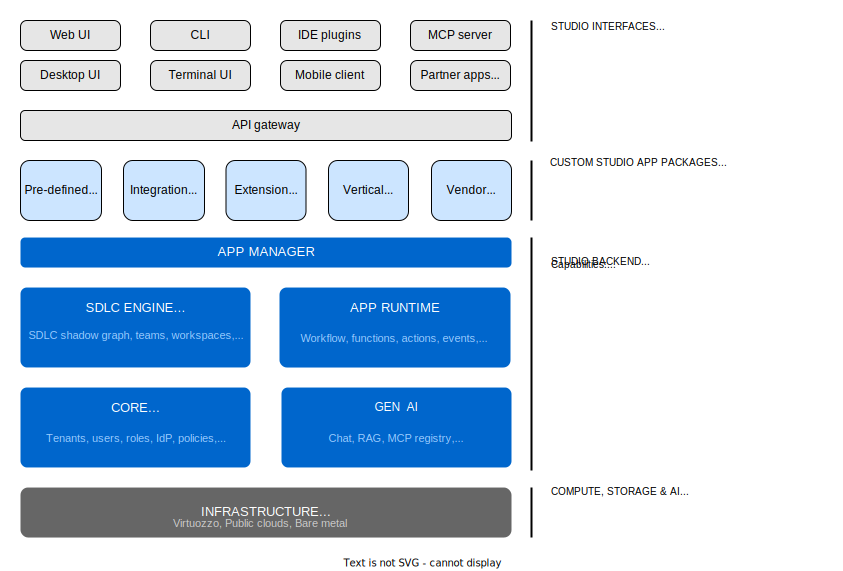

# Constructor Studio Architecture Vision



## Overview

**Studio** is the automated control plane for AI-native software construction.

It helps software companies turn fragmented tools, teams, and AI assistants into one governed delivery system that moves faster without losing control, visibility, or quality.

With Studio, organizations can go from intent to code, validation, release, and operations with traceability, approvals, and controlled automation across the full lifecycle.

Studio is not limited to one fixed SDLC flow. It is a flexible pipeline fabric where teams can start from product intent, architecture, code, pull requests, incidents, legacy systems, or operational signals, then compose the next best sequence of retrieval, generation, validation, approval, and write-back steps for that situation.

The Studio is therefore not just about one linear path from PRD to code. It is about making many possible SDLC automation journeys safe, modular, explainable, and adaptable to different team maturity levels, company processes, and deployment models.

A core Studio principle is that orchestration should remain deterministic wherever possible, while AI is used as a set of specialized workers for specific tasks rather than as one universal orchestrator. This gives teams tighter control over execution paths, makes outcomes easier to validate and audit, and keeps automation modular instead of collapsing too much decision-making into one opaque agent loop.

Studio is explicitly integrated with the two other Constructor Fabric elements: `Insight`, which provides telemetry collection and intelligence, and `Gears`, which provides the pre-defined SaaS building blocks used to build Studio itself and offered as a default SaaS stack through Studio base apps, references, documentation, templates, and CLI tooling.

## Top Layer: Studio Interfaces

Studio is exposed through multiple interfaces so teams can work in the tools and environments they already use:

- Web UI
- Desktop UI
- CLI tools
- Terminal UI
- IDE plugins (VS Code, JetBrains)
- Mobile client
- MCP server
- Partner apps (github, gitlab, confluence, etc)

These interfaces support both human users and machine-to-machine access through APIs, MCP, import/export, and extensible branded experiences.

## Extension Layer: Custom Studio App Packages

Studio supports custom app packages that add domain-specific capabilities:

- Integrations
- Workflows
- Templates
- Plugins
- Agents
- UI and CLI extensions
- Scripts
- Prompts
- Custom objects or custom object properties
- Quality gates
- Custom events
- Custom policies
- Custom models
- etc.

This layer makes Studio adaptable to different teams, industries, and software delivery models without forcing a single workflow.

Packages can define or extend Object types, workers, flows, validators, connector templates, policies, prompts, and reusable journey patterns. This makes Studio suitable for teams that want anything from read-only analysis to highly automated, policy-controlled SDLC execution and intelligence.

Studio apps can be built using pre-defined templates, declarative definitions or real code (Python, Starlark, TypeScript, Rust) and can extend and fully customize pre-defined scenarios and capabilities with help of integrated Studio Core, Generative AI, Serverless and SDLC Engine capabilities

## Platform Entry Point: API Gateway

All interfaces and app packages connect through a common API gateway.

The gateway provides a consistent access point for:

- Internal capabilities
- Outbound APIs invocation
- External integrations
- Agent and MCP communication

## Application Layer: App Manager

The App Manager is the orchestration layer for packaged experiences running on Studio.

It manages:

- Pre-defined base apps
- Integration apps
- Extension apps
- Vertical apps (e.g. SaaS, Mobile, WebSite, CLI tools, Studio apps, etc)
- Vendor apps

This allows Studio to behave both as a product and as a platform for building specialized software construction applications.

Studio lets teams build new Studio applications inside Studio itself, using templates, AI assistants, validators, and built-in build and packaging automation.

## Core Backend Capabilities

Studio backend is organized around four major capability blocks based on `Constructor Gears` libraries:

### SDLC Engine

The SDLC Engine manages the shadow graph of software delivery artifacts and their relationships.

It is responsible for:

- Shadow SDLC graph
- Object model and state transitions
- Teams, users and their profiles
- Workspaces and projects
- Traceability across artifacts
- Validation or objects changes history
- Evidence and audit trail
- Agentic tasks, loops, workflows and their executions

This is the system that grounds the user journeys, Objects, approvals, evidence, workspace scoping, and cross-stage lifecycle intelligence.

### App Runtime

The App Runtime executes workflows and automation.

It provides:

- Workers
- Flows
- Schedules
- Agentic loops
- Validators
- Worker interactions
- Workflows
- Functions
- Actions
- Events
- Jobs
- Sandboxes
- Resource management
- Usage tracking (APIs, tokens)
- Security & rutnime isolation
- Copmpute and AI limits

This is where retrieval Workers, authoring Workers, analyzers, validators, Connector operations, approvals, human-in-the-loop pauses, and asynchronous execution live.

### Core

The Core layer provides the foundational platform services required for enterprise operation:

- Tenants
- Users
- Roles
- Identity provider integration
- Policies
- Approvals
- Audit
- Licensing
- Usage tracking
- Billing (for cloud deployments)

This layer enables secure multi-tenant deployment and human-governed automation.

### Gen AI

The Gen AI layer provides AI orchestration and model-facing capabilities:

- Chat
- RAG
- MCP registry
- LLM registry
- LLM routing
- Self-hosted LLM support

This enables Studio to mix scripted automation, hybrid workers, and LLM-powered workers under one governed runtime.

By positioning AI as a set of task-specific workers inside deterministic workflows, Studio can optimize token usage and improve operational control. Teams can benchmark models per worker type, run A/B tests on prompts and routing strategies, compare model quality versus cost, and perform retrospective analysis on which workflow steps, models, and prompts actually produced the best outcomes. This makes Studio better suited for continuous optimization than architectures that rely on one universal agent to orchestrate everything.

### Insight Integration

Studio is deeply integrated with `Insight` as its telemetry collection and intelligence layer.

`Insight` collects signals from connected systems and turns them into cross-tool visibility, analytics, and operational intelligence that Studio uses to power traceability, recommendations, monitoring, and quality decisions.

### Gears Integration

Studio is also integrated with `Gears`, the reusable SaaS building-block layer within Constructor Fabric.

`Gears` is used to build Studio itself and is also positioned as a default reference stack for SaaS vendors through Studio base apps that can include Gears references, documentation, templates, and CLI tools.

## Infrastructure Foundation

Studio runs on flexible infrastructure, including:

- Virtuozzo cloud
- Acronis Frame
- Public clouds
- Bare metal or edge deployments

This supports cloud, on-prem, and end-user deployments, consistent with Studio’s open and deployment-flexible positioning.

Studio supports governed deployment of generated artifacts into target environments (dev, staging, production, edge) and continuously collects runtime telemetry from those applications. This telemetry feeds back into Studio’s shadow SDLC graph to power release validation, incident triage, performance and reliability analysis, and closed-loop improvement of automation policies, workflows, and AI-assisted changes.

## Logical Planes

Studio separates platform responsibilities into three logical planes:

1. Control plane - projects, people, workspaces
2. Knowledge plane - SDLC artifacts and traceability
3. Execution plane - Workers, Flows, validators, agents, and automation

This separation makes the system easier to scale, govern, and extend on every plane. Studio applications can extend any of these planes to customize existing or add new capabilities.

## Illustrative Mechanics

The achitecture vision above supports a broad operating model for Studio: not a single prescribed process, but a governed graph of Objects, Workers, Flows, Validators, Connectors, and approvals that can be assembled into many SDLC journeys.

### Pipeline fabric, not one pipeline

Studio should be understood as a configurable SDLC automation fabric.

Teams can enter from many starting points:

- Brand new or existing projects with one or many repositories
- Product intent
- Imported PRD (Product Requirement Document) or task
- Architecture question or ADR (Architecture Decision Record)
- Existing design needing decomposition
- Approved feature spec ready for implementation
- Pull request needing review and repair
- Legacy codebase needing reverse engineering
- Release candidate needing readiness assessment
- Cross-workspace object or dependency investigation
- Code review assistance
- Requirement vs implementation gap analysis

From any of these entry points, Studio can assemble a different path of retrieval, analysis, generation, validation, approval, and write-back.

### Shadow objects and validated actions

Studio works with familiar software-delivery artifacts rather than replacing existing systems of record.

It mirrors work from tools such as IDEs, source control systems, CI/CD, docs, and issue trackers into a shadow SDLC graph, then applies registered actions, validators, and approvals to move work forward safely.

Those actions are centered on Objects and executable graph edges:

- Objects represent artifacts such as PRDs, ADRs, designs, tasks, feature specs, source files, pull requests, releases, approvals, and evidence
- Workers consume and produce Objects
- Flows constrain required step order where governance matters
- Validators decide if an Object may advance or re-work is needed
- Connectors synchronize with external systems and perform controlled write-back
- Worker Interactions pause automation when human input or approval is required

### Composable SDLC pipeline patterns

```text
Entry point -> Retrieve context -> Transform or analyze -> Validate ->
approve or iterate -> optional write-back -> downstream trigger
```

Each worker action can be implemented as:

- Deterministic script
- Hybrid worker
- AI-assisted transformation
- Human task
- Connector sync or write-back

This lets Studio support linear flows, branching flows, loops, and partial journeys with the same underlying primitives. In this model, deterministic workflows remain the backbone of orchestration, while AI participates as specialized workers at specific steps such as retrieval, generation, analysis, or repair. That gives Studio more control over token consumption, better validation boundaries, and stronger support for A/B testing, model comparison, and retrospective workflow analysis.

### Validated action graph

```text
Object(s) + Context + Rules
        |
         v
Action / Transformation
         |
         v
Candidate Object(s) + Evidence
         |
         v
Validators
         |
  pass / fail / retry / escalate
```

Studio does not just generate artifacts; it validates whether work is ready to move to the next stage or helps humans to validate already generated artifacts.

The same pattern works for authoring, decomposition, code generation, pull-request review, change-impact analysis, release readiness, and reverse engineering of legacy systems.

### Validator loops

```text
             Candidate artifact
                     |
                     v
                Validators
                     |
           pass      |      fail
         +-----------+-----------+
         |                       |
         v                       v
     Next task              Fix / retry
                                 |
                           retry < limit?
                           /          \
                        yes            no
                         |              |
                         v              v
                   Candidate       Human escalation
                                   or abort
```

Validator loops create trust, auditability, and bounded automation.

They also make Studio suitable for progressive adoption:

- Read-only analysis first
- Recommendations next
- Approved automation after trust is established
- Wider enterprise automation once policies, evidence, and approvals are in place

### Human-controlled automation dial

Studio supports multiple automation modes within the same platform:

- Read-only retrieval and analysis
- Guided recommendations
- Approved automation for action Workers
- Enterprise-scale governed execution with approvals, policies, and write-back controls

This lets teams gradually move from insight to action without giving up human control over high-risk decisions.

### Connector-mediated execution

Studio does not try to replace GitHub, Jira, docs, CI/CD, cloud, or incident systems.

Instead, it mirrors their state into the shadow graph, reasons over the unified graph, and writes back through governed Connector boundaries when policy allows. This is what makes cross-tool, cross-role, and cross-workspace automation possible without forcing migration.

### Example journeys enabled by this architecture

```text
Plan -> PRD -> ADR -> Design -> Decomposition -> Feature Spec -> Code -> PR -> Release
PR -> Retrieve design context -> Validate -> Fix findings -> Revalidate -> Ready for review
Codebase -> Reverse engineer -> Reconstructed design or feature spec -> Gap validation
Changed object -> Traceability analysis -> Staleness detection -> Recommendations -> Downstream updates
Release candidate -> Impact analysis -> Coverage validation -> Approval -> Release decision
Bug report -> reproduction -> failing test -> fix PR
Architecture question -> option exploration -> ADR -> design reference
PRD -> Design -> Tasks -> Feature Spec -> PR validation
PR review -> findings -> fix loop -> clean PR
Legacy code -> reconstructed SDLC artifacts -> gap validation
Release candidate -> impact analysis -> approval gate
```

These are all first-class Studio journeys. They show how Studio combines shadow Objects, Workers, Validators, Connector sync, AI assistance, approvals, and evidence into reusable end-to-end journeys. The point is flexibility with governance, not forcing one master workflow.

In short, Studio v2 combines a shadow SDLC graph, a governed execution runtime, and a multi-interface experience into one extensible platform for software construction.

Its achitecture should be read as a system for orchestrating many possible SDLC automation pipelines, not a single golden path: teams can compose, validate, govern, and evolve their own journey patterns while preserving traceability, evidence, and control.
